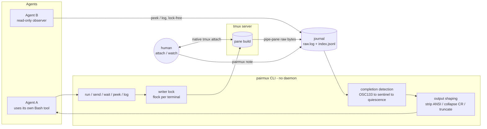

# Concepts

This page is for engineers evaluating the design. It explains *why* pairmux is built the way it is, not just what it does.

pairmux is deliberately **not** a new terminal. It does not implement a PTY or a VT parser, and it runs **no daemon**. It is a thin coordination layer over tmux that adds exactly the three things agents need and raw tmux lacks: a signal for *when a command is done*, *clean full history*, and a *shared writer discipline* so humans and agents can use the same live terminal.

## Architecture



Everything is short-lived: `run`/`wait` are ordinary processes that poll the journal file until their condition is met, then exit. There is no background service to install, supervise, or crash. State lives in two places: tmux pane user-options (which live and die with the pane) and a per-terminal directory under `~/.local/state/pairmux/`.

## tmux as the terminal state engine

tmux already maintains screen rendering, scrollback, and — crucially — lets a human `attach`. pairmux leans on all of it instead of reimplementing any of it:

- **No PTY, no VT parser.** pairmux only ever *exec*s tmux subcommands (`new-window`, `send-keys -l`, `pipe-pane`, `capture-pane`, pane options).
- **Human access is nearly free.** `pairmux attach` is a thin wrapper over `tmux attach`; `peek --screen` is a `capture-pane` render. Because the human and the agent share one real tmux pane, a human can literally type into the command the agent is running.

This is the opposite of headless-PTY tools (`ht`, `agent-tty`), which isolate the terminal by design. For pairmux, human-in-the-loop *is* the reason it exists, so sharing a real tmux pane is the point.

## The journal: single source of truth

When a terminal is created, pairmux attaches `tmux pipe-pane` to stream the pane's **raw output bytes** into a journal. `capture-pane` is demoted to an auxiliary "what does the screen look like right now" view.

```text
~/.local/state/pairmux/<terminal>/
  raw.log       # pipe-pane raw bytes (mode 0600)
  index.jsonl   # {ts, type, cmd_id, offset, exit_code?, text?} — one event per line
  meta.json     # name, pane id, shell, mode, socket
```

The journal is what makes three otherwise-hard problems easy:

- **Truncation is never silent.** A reply carries `head` + `tail` plus a `truncated.get_full` command that returns the complete region (`pairmux log <name> --cmd N`).
- **Scrolled-off output is still there.** `pairmux log --grep`/`--range`/`--cmd` query the full history, not the viewport.
- **Multi-agent reads are lock-free.** Reading a file needs no coordination, so any number of agents can watch the same terminal (for example, several agents tailing one dev-server's log).

`run` captures a command's output by recording the journal byte-offset when it sends the command (`cmd_start`) and the offset of the completion mark (`cmd_end`), then shaping the bytes between them.

## The blocking CLI as the "poke"

The timing problem — *when should the agent read the output?* — is solved without any push channel. The insight: an agent's shell tool call is **already blocking**. So pairmux makes the CLI block:

> `pairmux run` and `pairmux wait` poll the journal internally and return only when the command finishes, output goes quiet, a pattern appears, or the timeout fires.

The agent never writes `sleep` and never decides how long to wait. Polling, quiescence detection, and timeouts all live inside the CLI. Even a timeout is not a failure — it returns `status: running` with the current tail and a `next` step for continuing to wait.

## Three-tier completion detection

Knowing a command *finished* (and its exit code) drives everything. pairmux detects it with three tiers that degrade gracefully:

1. **OSC 133 shell integration (primary).** `new` launches the shell with injected hooks — bash via `--rcfile`, zsh via a `ZDOTDIR` shim — that emit OSC 133 `A`/`B`/`C`/`D` marks, where `D` carries the exit code. pairmux parses these marks straight out of the journal, so it does **not** depend on tmux's own OSC 133 support. This yields precise "command start / output region / end + exit code" boundaries. Terminals using this tier report `mode: hooks`.
2. **Sentinel (fallback).** When hooks can't be injected (an unknown shell, or an explicit `--cmd` program), `run` appends `; printf '\033]7779;p;%d\007' $?` to the command. The marker reaches the journal via pipe-pane but renders as nothing on screen. Terminals report `mode: sentinel`.
3. **Quiescence (backstop).** `wait --idle` resolves on output silence (journal untouched for N ms), for "the program is still running but I want to look now" cases.

`pairmux doctor` reports the tier each shell actually reaches, including `hooks-no-C` — bash 3.2 emits `A`/`D` but never the `C` (output-start) mark, so completion detection works but human-interleave correlation is slightly weaker. In hooks mode, completion is correlated to *pairmux's own* command marks, so a human typing commands in the same pane cannot spoof a completion.

### awaiting-input detection

Separately, pairmux watches for a command that has gone **quiet with a prompt-shaped last line** — `[y/N]`, `password:`, a pager's `--More--`/`(END)`, "press any key". This refines `running` into the `awaiting-input` status. It is surfaced as a status only; pairmux never auto-answers.

Password/passphrase/passcode prompts are classified as **secrets**. Instead of a "send this answer" hint, the reply says `do NOT guess or type secrets` and points at human handoff (`wait --human --notify`). See [human collaboration](./guides/human-collaboration.md).

## Self-teaching output

Weak models don't reliably remember documentation, so **every reply embeds the exact next step**. Truncated output ships the `get_full` command; a still-running command ships a `wait` command; an awaiting-input reply ships a `send` example (or the secret-handoff instruction); a busy terminal reports who holds the lock. Errors do the same — a mistyped name lists the terminals that do exist. The skill teaches the workflow; the reply teaches the next step. Two layers catch a weak model.

## Concurrency and locking

- **Reads** (`peek`, `log`, `ls`, `wait`) are lock-free and record nothing.
- **Writes** (`run`, `send`) take a per-terminal `flock`. When it is contended, pairmux returns an `E_BUSY` envelope immediately, naming the holder's pid — it does not queue. The agent decides whether to wait or read-only instead.
- **Humans** type through native tmux and bypass the lock, but attach and note events are recorded in the journal, so the agent's next reply can tell it a human was involved.

## Statuses and modes

The full status and mode tables live in the [CLI Reference](./cli-reference.md#statuses). In short: a terminal is `idle` / `running` / `awaiting-input` / `dead`, and each terminal runs in `hooks` or `sentinel` completion mode.
